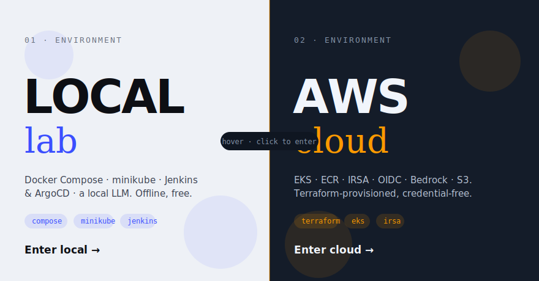
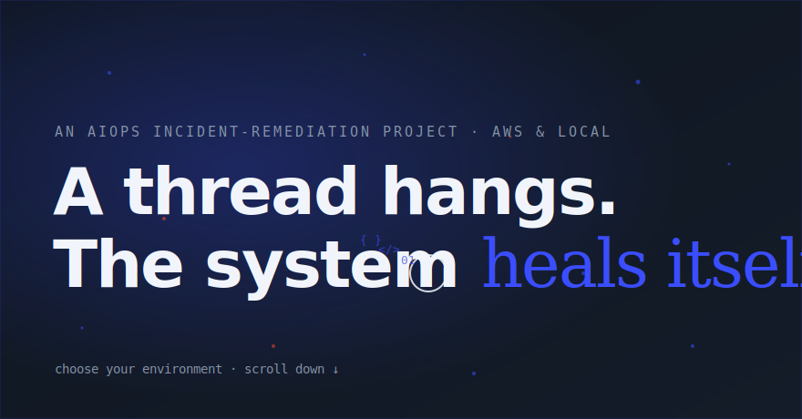
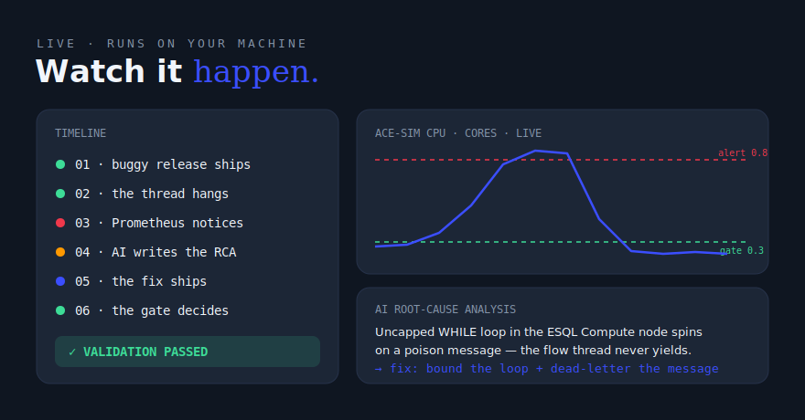

<div align="center">

# ⚡ AIOps ACE Remediation

### AI-driven incident detection, root-cause analysis, and validated remediation

*A hung thread pegs a CPU. An LLM reads the evidence and writes the RCA. The fix ships.
A hard metric gate proves recovery — before you've opened your laptop.*

[](https://www.python.org/)
[](https://www.terraform.io/)
[](https://kubernetes.io/)
[](https://prometheus.io/)
[](https://github.com/features/actions)
[](#llm-backends)

</div>

---

## What this is

```
[1] Buggy ACE app (hung-thread ESQL) ── built by CI → ECR → EKS (Terraform infra)
[2] Prometheus detects CPU spike ──► Grafana dashboard
[3] Alertmanager ──► AI Triage (FastAPI): logs + metrics + ESQL source
        └► LLM (Ollama local / Claude via Anthropic API or Bedrock) → RCA + fix diff → GitHub issue
[4-5] Fix merged → build → Trivy → ECR → EKS deploy (GitHub OIDC, no keys)
[6] AI Validation Gate: hard CPU threshold + advisory LLM verdict → PR comment
```

A production incident lifecycle, fully automated and fully demoable — end to end, live,
in your browser.

## The experience

An immersive, cinematic front end for the whole pipeline — not a static dashboard.
**▶ [Live showcase page](https://manibhargava4.github.io/aiops-ace-remediation/)** ·
previews below are approximate SVG mockups.

<table>
<tr>
<td width="50%"></td>
<td width="50%"></td>
</tr>
<tr>
<td><b>Enter a world.</b> A cinematic loader and full-screen intro, then a scroll-driven transition assembles a game-style <b>Local | AWS Cloud</b> picker — each world its own design, architecture story, and demo surface.</td>
<td><b>The signature hero.</b> The headline splits into letters that fly in with 3D rotation + blur and ripple on hover; a blend-mode cursor with a floating-code trail moves over a Three.js particle field.</td>
</tr>
</table>



**Watch it happen.** The live demo streams the real incident loop over SSE — buggy
release ships → CPU spikes past the alert threshold → AI writes the RCA → fix redeploys →
a hard validation gate proves recovery — with a live CPU chart. A **CI/CD tab** runs the
same flow through **Jenkins** (push) or **GitHub Actions → ArgoCD** (pull GitOps) against
a real local cluster.

**Motion, with purpose** — all vanilla JS on GSAP + Three.js, no build step: scramble-decode
on labels, glow on headings, cursor spotlight on the hero, proximity-magnify on the live
architecture diagrams, Lenis smooth scroll, and a horizontal six-stage pipeline walk.

### Demo video

<!-- Record the running site and drop it at docs/assets/demo.mp4, then replace this line with:
<video src="https://github.com/manibhargava4/aiops-ace-remediation/assets/demo.mp4" controls></video> -->
*Coming soon — a screen recording of the live experience.*

## Three ways to run it

| Mode | Stack | Where |
|---|---|---|
| **Local demo** | Docker Compose + Ollama | website "Live Demo" — the full incident loop in ~7 min |
| **Local Kubernetes** | minikube + **Jenkins (push)** or **GitHub Actions → GHCR → ArgoCD (pull GitOps)** | website "CI/CD" tab · [ci/README.md](ci/README.md) |
| **AWS** | EKS/ECR/IRSA/OIDC/Bedrock via Terraform | website Cloud mode + [docs/aws-deployment.md](docs/aws-deployment.md) |

Cloud mode never fakes readiness — it probes for real AWS credentials and an EKS context
before enabling its demo, and says exactly what's missing when it can't.

## Learn / own this project

| Doc | What it's for |
|---|---|
| [STUDY.md](STUDY.md) | Concepts + interview prep per component, 7-day study plan |
| [docs/BUILD_JOURNAL.md](docs/BUILD_JOURNAL.md) | How it was built — every decision vs. its alternatives |
| [docs/EXTENSIONS_GUIDE.md](docs/EXTENSIONS_GUIDE.md) | Four features to build yourself — guided, no code given |

## Quick start (local, free, offline LLM)

Prereqs: Docker Desktop running, [Ollama](https://ollama.com) with `ollama pull qwen3:8b`, Python 3.11+.

```powershell
pip install fastapi uvicorn requests
python website/server.py
# open http://localhost:8080 → Local → Live Demo → Start Demo
```

The website runs the whole loop live (~6–10 min): deploy buggy release → CPU spike →
alert fires → AI writes the RCA → fixed flow redeployed → validation gate passes.

Or without the website: `docker compose up -d --build` and watch
[Grafana](http://localhost:3000/d/ace-incident) / [Prometheus alerts](http://localhost:9090/alerts);
the RCA lands in `incidents/<id>/rca.md`.

## LLM backends

`LLM_BACKEND=ollama | anthropic | bedrock` (see [.env.example](.env.example)):

| Backend | Auth | Use |
|---|---|---|
| `ollama` (default) | none | free, offline demo (qwen3:8b) |
| `anthropic` | `ANTHROPIC_API_KEY` (Secrets Manager on AWS) | Claude via the Anthropic API |
| `bedrock` | IRSA on EKS — no keys in the pod | Claude via Amazon Bedrock |

## Repo map

| Path | What |
|---|---|
| `app/` | ACE simulator — buggy vs fixed transform, ESQL sources, Prometheus metrics |
| `ai-triage/` | webhook → collectors → `llm.py` (3 backends) → RCA reporter + validation gate |
| `monitoring/` | Prometheus rules, Alertmanager webhook, Grafana dashboard (local) |
| `docker-compose.yml` | one-command local stack |
| `ci/` | local registry, Jenkins-as-code pipeline, `k8s/local/` deploy target |
| `terraform/` | AWS: VPC, EKS (spot), ECR, S3 evidence, Secrets Manager, IRSA, GitHub OIDC role |
| `k8s/` | EKS + local manifests: ace, ai-triage (IRSA + RBAC), kube-prometheus-stack values, ArgoCD Application |
| `.github/workflows/` | ci-cd (build→Trivy→ECR/GHCR→deploy), ai-validate (gate→PR comment), terraform (+Checkov) |
| `website/` | the showcase above — animated dual-world site + live demo/CI/CD runner (SSE) |
| `docs/` | AWS runbook, GitHub token setup |

## AWS deployment

See [docs/aws-deployment.md](docs/aws-deployment.md). Cost discipline: `terraform apply`
when working, `terraform destroy` after each session — ephemeral environments by design.
